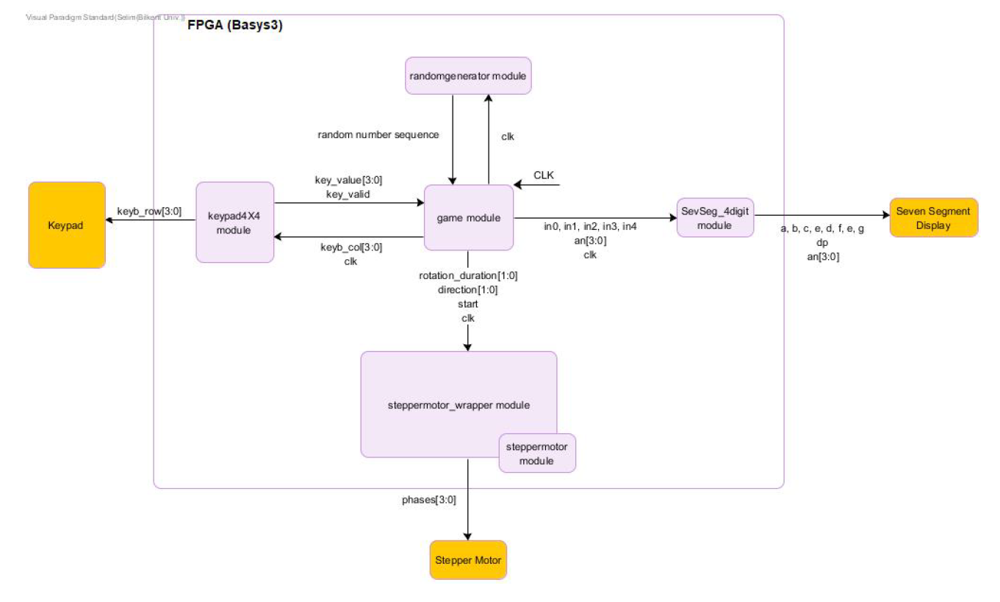
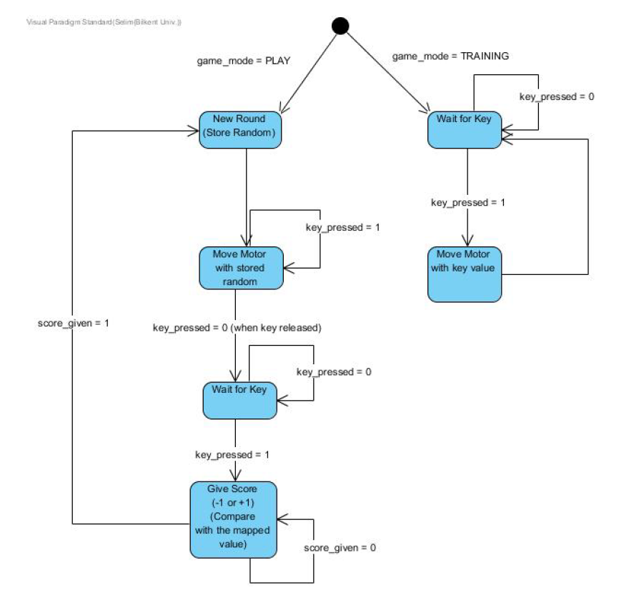

# Game of Codes

## Project Description

This game named Game of Codes is developed for educational purposes as a
project for CS 223 course in Bilkent University. For detailed description, see [Project Final Report](project-final-report.pdf).

## Project Design
### Block Diagram

### Finite State Machine of Game Logic

## Game Modes

### Play Mode

When game starts, the stepmotor moves according to a random sequence of move ments. Then, it waits for player to press a button on 4x4 keypad. 
If player presses the correct button, score will be incremented by 1. If player presses the wrong button, score will be decremented by one. 
Score is shown on the most right part of the 7-segment and is limited to the range of 0-9. 

Player can turn on the most right switch on Basys3 (V17) to go back to the training
mode.

### Training Mode

In this mode, when a key in the 4x4 keypad is pressed, the the stepmotor moves
according to the corresponding sequence of moves in the mapping table. As a remark,
if player goes in to training mode, the score will reset to 0.

Player can turn off the most right switch on Basys3 (V17) to go back to the play
mode.

For mapped keycodes, see [Project Final Report](project-final-report.pdf).

